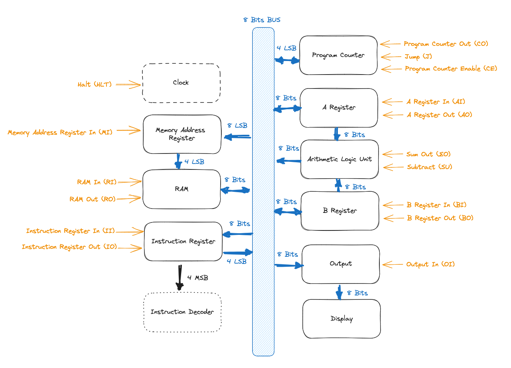

# 8 Bit CPU

## Architecture Overview



## Controls

| ID  | Name               | Description                                                | Mask              |
|-----|--------------------|------------------------------------------------------------|-------------------|
| HLT | Halt               | Halt the clock                                             | `100000000000000` |
| MI  | Memory Input       | Update RAM address with bus value                          | `010000000000000` |
| RI  | RAM Input          | Write RAM current address value with bus value             | `001000000000000` |
| RO  | RAM Output         | Output RAM current address value to the bus                | `000100000000000` |
| IO  | Instruction Output | Output address pointer of current instruction to the bus   | `000010000000000` |
| II  | Instruction Input  | Read current instruction from the bus                      | `000001000000000` |
| AI  | A Register Input   | Update A register value with bus value                     | `000000100000000` |
| AO  | A Register Output  | Output A register value to the bus                         | `000000010000000` |
| ∑O  | Sum Output         | Output the ALU value to the bus                            | `000000001000000` |
| SU  | Subtract           | Activate ALU subtraction mode                              | `000000000100000` |
| BI  | B Register Input   | Update B register value with bus value                     | `000000000010000` |
| OI  | Output Input       | Update output display value with value from the bus        | `000000000001000` |
| CE  | Counter Enable     | Enable program counter                                     | `000000000000100` |
| CO  | Counter Output     | Output the current value of the program counter to the bus | `000000000000010` |
| J   | Jump               | Update program counter to value from the bus               | `000000000000001` |

## Instructions

Every instruction is decomposed into 5 micro instructions.

The first two micro instructions are always the same. They fetch + load instruction from the memory address pointed by the program counter and increment the program counter.

0. `MI` + `CO`
1. `RO` + `II` + `CE`

After that, the loaded instruction's specific micro instructions are run.

### NOP (0000)

2. *Nothing*
3. *Nothing*
4. *Nothing*

### LDA (0001)

2. `MI` + `IO`
3. `RO` + `AI`
4. *Nothing*

### ADD (0010)

2. `MI` + `IO`
3. `RO` + `BI`
4. `AI` + `∑O`

### SUB (0011)

2. `MI` + `IO`
3. `RO` + `BI`
4. `AI` + `∑O` + `SU`

### STA (0100)

2. `MI` + `IO`
3. `AO` + `RI`
4. *Nothing*

### LDI (0101)

2. `IO` + `AI`
3. *Nothing*
4. *Nothing*

### JMP (0110)

2. `IO` + `J`
3. *Nothing*
4. *Nothing*

### OUT (1110)

2. `AO` + `OI`
3. *Nothing*
4. *Nothing*

### HLT (0011)

2. `HLT`
3. *Nothing*
4. *Nothing*

## Instruction Register

The instruction register works with two EEPROM chips (AT28C64B), flash the first one on the left with `instruction_register_1.bin` and the second one on the right with `instruction_register_2.bin`.

### Generating binaries

```
$ go run ./gen_instruction_register.go
```

### Flashing using TommyPROM

You can flash the EEPROM chips using [TommyPROM](https://tomnisbet.github.io/TommyPROM/).

On OSX you will need to install xmodem:

```
$ brew install lrzsz
```

Then connect to the device with screen:

```
screen /dev/tty.usbserial-xxxxxx 115200
```

Use the `W` command and send the file using xmodem:

```
Press CTRL+a
:exec !! lsx -b -X /path/to/instruction_register_x.bin
```

## Test program

```
0000: 0001 1110 - LDA 1110
0001: 0010 1111 - ADD 1111
0010: 1110 0000 - OUT
0011: 1111 0000 - HLT
1110: 0001 1100 - 28
1111: 0000 1110 - 14
```